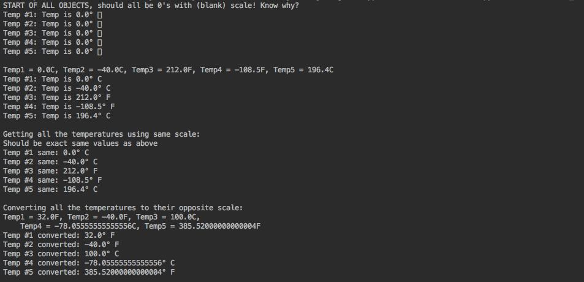

## Temperature Project

Define a Temperature class that has instance variables: temperature value (a floating-point number) and character
for the scale, either ‘C’ for Celsius or ‘F’ for Fahrenheit. And the following methods only:

<li>toString method</li>
<li>setValue method to set temperature only</li>
<li>setScale method to set scale only (‘F’ or ‘C’, should allow lower case too, any other char is treated as ‘C’)</li>
<li>setAll method to set both temperature value and scale (hint: see if you can reuse two methods above!)</li>
<li>getCelsius method to return the degrees Celsius (without changing the instance variable)</li>
<li>getFahrenheit method to return the degrees Fahrenheit (without changing the instance variable)</li>
 

